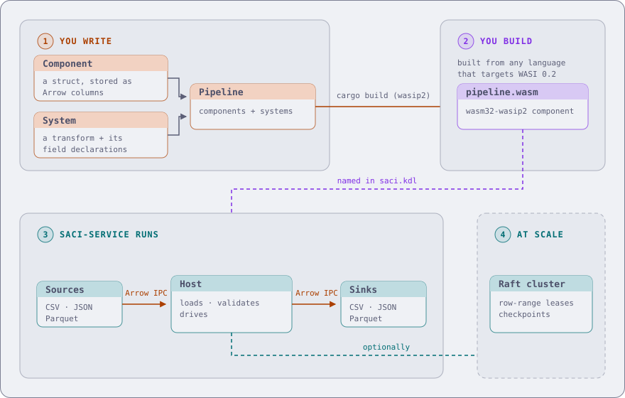

<div align="center">
  

  <h1>SACI</h1>

  <p><strong>Data pipelines that schedule themselves, from the fields each transform declares.</strong></p>

[](https://nassor.github.io/saci/)
[](https://github.com/nassor/saci/actions/workflows/ci.yml)
[](LICENSE)
[](https://www.rust-lang.org)
[](#project-status)

</div>

## What it is

SACI (Self-orchestrated Autonomous Compute Interface) is a columnar batch processing engine built
on Apache Arrow.

You write transforms as plain structs. Each one declares which Arrow fields it reads and which it
writes, and that declaration is the only scheduling input SACI needs. It builds a dependency graph
from the field overlaps, groups work that cannot conflict into stages it can run concurrently,
retries what fails, and optionally spreads the work across a cluster.

The engine and the host are Rust. The pipeline contract is the `saci:pipeline@0.3.0` WIT world, so
any language that compiles to a WASI 0.2 component can implement it. The Rust processor SDK is
optional. See
[WebAssembly processors](https://nassor.github.io/saci/service/processors/build/).

## What it is for

Reach for SACI when:

- Work arrives as batches of 100k to 100M rows, or as a stream of individual items you want
  processed one at a time.
- The transform is imperative code that SQL expresses awkwardly.
- Schemas are wide, tens to hundreds of columns, of which each step touches a few.
- Recovery time is a design constraint.

Look elsewhere when you want SQL (use [DataFusion](https://datafusion.apache.org/)), or you have
fewer than ~10k rows total and a `Vec` would do. For per-item processing, run the same pipeline in
[stream mode](https://nassor.github.io/saci/service/config/run-modes/), under a millisecond per item in-process.
Batch mode is the default for throughput.

That field declaration is what "self-orchestrated" in the name refers to. The `Component` and
`System` vocabulary comes from ECS (Entity Component System) in game development. ECS organises
game entities as components that systems act on each frame. SACI organises a data `Pipeline`
as `Component`s that `System`s transform in field-granular DAG order.

## End to end

SACI is service-first. You deploy `saci-service` once and hand it WebAssembly components, so the
pipeline ships separately from the binary that runs it.

<p align="center">
  
</p>

The processor component owns the DAG, the stage plan, and retry. The host owns IO, checkpointing,
distribution, and the HTTP control plane. Data crosses the boundary as Arrow IPC bytes and nothing
else, so your pipeline never opens a socket or a file.

## Why columns

Storing each field as a contiguous Arrow column, rather than a row per record, changes what the
machine has to move:

- Arithmetic, at 8 bytes per column: a system reading 3 of 50 columns loads 24 MB per million rows,
  where a row layout loads all 400 MB.
- Handing a batch to the next stage is an `Arc` clone: one atomic increment, no copy.
- Checkpointing is a contiguous buffer write, so recovery decodes 6x faster than a row-oriented
  equivalent at 1M rows.

Numbers and methodology: [benchmark results](https://nassor.github.io/saci/library/reference/benchmarks/).

## Quick start

You need git and a Rust 1.95 toolchain installed through rustup. About fifteen minutes end to end.
These commands run the same on Linux, macOS and Windows (PowerShell):

```bash
git clone https://github.com/nassor/saci
cd saci
```

Then run a pipeline without writing any code:

```bash
cargo run -p saci-service --example scheduler_etl
```

It prints the stage plan SACI derived from the systems' field declarations (ValidateSystem and
EnrichSystem share stage 1 because they write disjoint fields), then a summary report: 9
transactions, 7 valid, 2 rejected.

To write your own component and the config that runs it, follow
[Build your first pipeline](https://nassor.github.io/saci/library/first-pipeline/).

## Six languages, one pipeline

`examples/polyglot/` implements a single `Order` workload as six separate WebAssembly components,
chained by a Rust driver through the same host `saci-service` uses. All six export the same WIT
world.

| # | stage | language | toolchain | writes |
|---|-------|----------|-----------|--------|
| 1 | `validate-go` | Go | `componentize-go` | `valid` |
| 2 | `enrich-py` | Python | `componentize-py` | `usd_amount`, `usd_amount_display` |
| 3 | `score-ts` | TypeScript | `jco` | `risk_score`, `flagged` |
| 4 | `fee-kt` | Kotlin | Gradle plus `wit-bindgen` and `wasm-tools` | `fee` |
| 5 | `tier-cs` | C# | `componentize-dotnet` | `review_tier` |
| 6 | `settle-rs` | Rust | `cargo build --target wasm32-wasip2` | `settlement` plus a cross-batch ledger |

Building the six stages needs the Rust wasm target and `wasm-tools`, plus five language
toolchains and curl, which `cargo xtask polyglot` uses once to fetch the WASI preview 1 adapter
the Kotlin stage needs. [`examples/polyglot/PINS.md`](./examples/polyglot/PINS.md) carries every
version and the platform caveats:

```bash
rustup target add wasm32-wasip2
cargo install wasm-tools --locked --version 1.246.2   # pinned in examples/polyglot/PINS.md
```

Then build every stage and drive the chain:

```bash
cargo xtask polyglot
cargo run -p saci-service --features wasm,tracing --example polyglot_orders
```

Every command in this section runs the same on Linux, macOS and Windows (PowerShell). The processor
build page has the byte-level contract and a recipe per language, including the
[six-language example](https://nassor.github.io/saci/service/processors/build/#4-six-languages-one-pipeline).

## Documentation

| | |
|---|---|
| [What SACI is](https://nassor.github.io/saci/) | The one-paragraph pitch and the end-to-end diagram |
| [Run the service](https://nassor.github.io/saci/service/) | What a config declares, and the vocabulary behind every key |
| [Your first pipeline](https://nassor.github.io/saci/service/first-pipeline/) | Install the binary, then run a real pipeline in 15 minutes |
| [The config file](https://nassor.github.io/saci/service/config/) | Every top-level key, variables, and validation |
| [Sources and sinks](https://nassor.github.io/saci/service/connectors/) | One page per connector, as a source and as a sink |
| [Formats](https://nassor.github.io/saci/service/formats/) | csv, ndjson, parquet, avro and arrow-ipc |
| [Build a processor](https://nassor.github.io/saci/service/processors/build/) | The WIT contract, a recipe per language, and the six-language example |
| [Plugins](https://nassor.github.io/saci/service/plugins/) | A native shared library instead of a component |
| [Operating](https://nassor.github.io/saci/service/operate/) | The command line, observability, the dashboard, clusters |
| [As a Library](https://nassor.github.io/saci/library/) | Link the engine into your own binary: Dataset, System, Pipeline, Scheduler, distribution |
| [Build your first pipeline](https://nassor.github.io/saci/library/first-pipeline/) | A native pipeline in nine steps, from the component to the stage plan |
| [Tracing & metrics](https://nassor.github.io/saci/library/tracing/) | Spans, metrics, and the Prometheus endpoint |
| [The SDK packages](https://nassor.github.io/saci/library/reference/sdk-packages/) | One `saci-sdk` per language, the Arrow codec inside each |

Also in this repo: the [WASM processor example](./examples/wasm/), the [polyglot
example](./examples/polyglot/), [Rust-native examples](./examples/native/), the
[branching example](./examples/branching/), the
Apache-2.0 [SDK packages](./packages/), and toolchain pins for [Rust
processors](./crates/saci-processor/PINS.md) and [the other
languages](./examples/polyglot/PINS.md).

## Main crates

| Crate | What it holds |
|---|---|
| `saci-core` | `Dataset`, `Component`, `System`, `Pipeline`, `Scheduler`, the `Source`/`Sink` traits |
| `saci-service` | The host binary: wasmtime, KDL config, HTTP control plane, distributed runner |
| `saci-processor` | The processor SDK and the canonical `saci:pipeline@0.3.0` WIT world |
| `saci-connector-*`, `saci-transformer-*` | One transport and one byte format per crate |
| `saci-plugin`, `saci-plugin-abi` | The native plugin SDK and its C ABI; the host is `saci-service` |

The workspace map and the build and test commands live in [`AGENTS.md`](./AGENTS.md); the
per-area reference for each crate group sits beside it under `.agents/skills/`.

## Project status

This is a playground project exploring two things:

1. How far specialised AI coding agents can maintain a non-trivial Rust codebase, spanning
   multiple crates, a binary, and a WebAssembly component, with minimal human intervention in
   maintenance and review.
2. The design space of a Rust-native batch engine with WebAssembly extensibility.

It is not production-ready and the crates are not published to crates.io. Contributions and
feedback are welcome.

## License

Licensed under the GNU Affero General Public License v3.0. See [LICENSE](LICENSE). The `packages/`
subtree is Apache-2.0, see [packages/LICENSE-APACHE](packages/LICENSE-APACHE).
